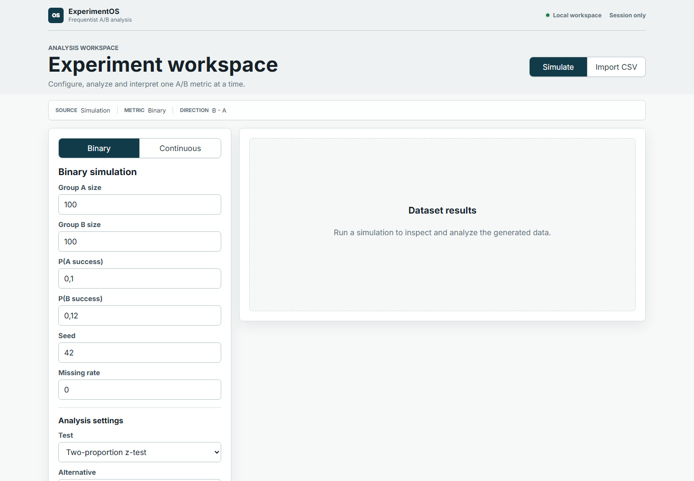
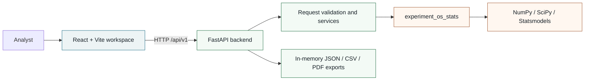
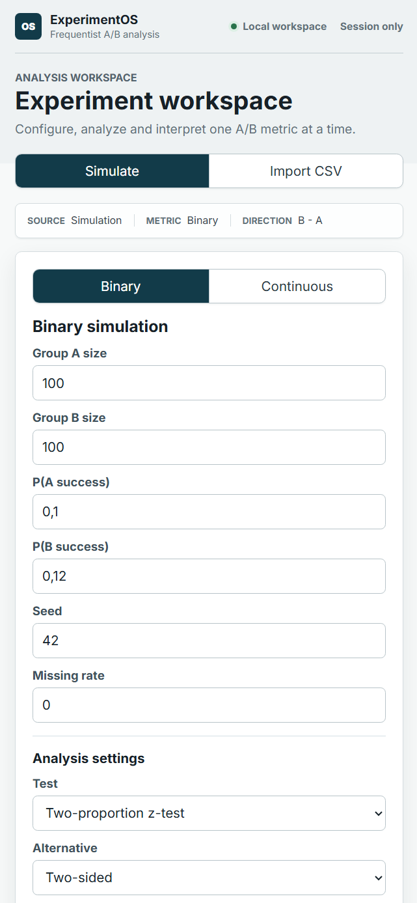

# ExperimentOS

[](https://github.com/AhmedHABBANI/Experiment_OS/actions/workflows/backend.yml)
[](https://github.com/AhmedHABBANI/Experiment_OS/actions/workflows/frontend.yml)
[](https://github.com/AhmedHABBANI/Experiment_OS/actions/workflows/docker.yml)


**A local, reproducible workspace for trustworthy frequentist A/B analysis.**

ExperimentOS turns an A/B dataset into a complete analysis workflow: simulate or import
data, inspect diagnostics, choose a statistical method, interpret uncertainty, and export
the result. It combines a framework-independent Python statistics package, a typed FastAPI
boundary, and a professional React workspace.



## Why this project exists

A notebook can calculate a p-value. A reliable experimentation workflow also needs stable
contracts, input validation, explicit assumptions, reproducibility, cautious language,
visual diagnostics, and testable exports. ExperimentOS packages those concerns into one
local application without hiding the statistical choice from the analyst.

| What it demonstrates | Evidence in the repository |
| --- | --- |
| Statistical engineering | Seven frequentist methods, common result contract, effect sizes, intervals, warnings |
| Scientific validation | SciPy/Statsmodels comparisons plus seeded false-positive, power, and coverage checks |
| Full-stack architecture | Independent Python package, FastAPI service layer, React workspace |
| Reproducibility | Explicit seeds, exported configuration, pinned npm lockfile, Docker Compose |
| Production discipline | Structured errors, accessibility states, 376 Python tests, 31 frontend tests, CI |
| Privacy by design | In-memory processing only; no database, account, analytics, or external data transfer |

## Product workflow

1. Simulate a binary or continuous experiment, or import a CSV.
2. Map control A, treatment B, and one metric explicitly.
3. Review retained observations, descriptive statistics, and diagnostics.
4. Manually select and configure a compatible statistical method.
5. Read the `B - A` estimate, interval, p-value, effect size, warnings, and deterministic interpretation.
6. Export analyzed data, flattened results, JSON, or a PDF report.

The application never automatically chooses a test and never uses an LLM to generate a
conclusion.

## Statistical methods

| Metric | Method | Primary role |
| --- | --- | --- |
| Binary | Two-proportion z-test | Large-sample comparison of independent rates |
| Binary | Fisher's exact test | Exact inference for a 2 x 2 table |
| Continuous | Student's t-test | Mean comparison under equal-variance assumptions |
| Continuous | Welch's t-test | Mean comparison without equal-variance assumption |
| Continuous | Mann-Whitney U | Rank-based distributional comparison |
| Continuous | Permutation mean test | Seeded Monte-Carlo test of the mean difference |
| Continuous | Bootstrap difference | Percentile interval for a mean or median difference |

Every applicable analysis follows the same `StatisticalResult` contract: hypotheses,
statistic, p-value, alpha, `B - A` estimate, confidence interval, effect size, decision,
assumptions, warnings, interpretation, and reproducibility metadata.

## Architecture



The statistical package owns every authoritative calculation and has no FastAPI or React
dependency. The backend validates and serializes. The frontend orchestrates the workflow
and presentation; it does not duplicate scientific logic.

## Statistical safeguards

- **Manual method selection:** the product explains conditions and warnings but does not
  silently choose a test.
- **Direction is explicit:** effects and intervals are consistently oriented as `B - A`.
- **Missing data is controlled:** normalization records exclusions instead of silently
  coercing invalid values.
- **Warnings are structured:** small samples, degenerate variance, undefined ratios, and
  fragile assumptions remain machine-readable and visible in the UI.
- **Interpretation is deterministic:** non-significant results are never described as proof
  of equality, and statistical significance is separated from practical importance.
- **Resampling is reproducible:** permutation and bootstrap procedures accept seeds and
  report their settings.
- **Reference agreement is tested:** analytical methods are compared with SciPy or
  Statsmodels where an independent reference exists.

### Monte-Carlo validation

The suite uses fixed seeds and bounded simulations so scientific checks remain reproducible
in CI. The table reports the acceptance criteria that currently pass, not post-hoc estimates.

| Validation scenario | Replications | Passing criterion |
| --- | ---: | --- |
| Binary z-test under H0 | 500 | False-positive rate between 2% and 8% |
| Fisher exact under H0 | 500 | False-positive rate at most 5% |
| Binary directional effect | 300 | Power at least 75% |
| Student and Welch under equal-variance H0 | 500 | False-positive rate between 2% and 8% |
| Welch under unequal, unbalanced H0 | 500 | Controlled at 2%-8% while Student is demonstrably inflated |
| Student and Welch directional effect | 300 | Power at least 80% |
| Mean bootstrap 95% interval | 60 datasets x 300 resamples | Empirical coverage between 85% and 100% |
| Permutation test under H0 / H1 | 100 datasets x 199 permutations | False positives 1%-10%; directional power at least 75% |
| Permutation stability | 12 seeds | 1,000-permutation p-values materially less dispersed than 100-permutation values |

These simulations are safeguards for implementation behavior, not universal performance
claims for every data-generating process.

## Quick start

Requirements: Docker Desktop with Docker Compose v2.

```bash
git clone https://github.com/AhmedHABBANI/Experiment_OS.git
cd Experiment_OS
docker compose up --build
```

Open:

- application: `http://127.0.0.1:5175`
- API documentation: `http://127.0.0.1:8000/docs`
- health endpoint: `http://127.0.0.1:8000/api/v1/health`

Stop and remove the local stack with:

```bash
docker compose down
```

CSV uploads are limited to 5 MiB by default. Copy the values from [`.env.example`](.env.example)
into a root `.env` file to configure the supported limit.

## Engineering decisions

- **Monorepo, explicit boundaries:** application layers live together while the statistics
  engine remains independently installable and testable.
- **One common result model:** every test returns a stable contract instead of endpoint-
  specific dictionaries.
- **Service-oriented backend:** routes handle HTTP concerns; services call the statistical
  package and build exports.
- **No persistence in V1:** removing database and authentication concerns keeps the project
  focused on scientific correctness and local privacy.
- **Lazy Plotly loading:** the initial application bundle is about 225 kB; the large Plotly
  runtime is deferred until charts are needed.
- **Structured failure contracts:** domain errors and request-validation errors expose safe,
  stable codes while unexpected failures are logged server-side.
- **CI mirrors local quality gates:** Python, frontend, Docker builds, and Compose validation
  run independently on pushes and pull requests.

## Repository map

```text
packages/experiment_os_stats/  framework-independent statistics engine
backend/                       FastAPI schemas, routes, services, and exports
frontend/                      React workspace and Plotly presentation
docs/                          CSV, statistical, and interpretation guides
examples/                      tested binary and continuous CSV examples
specs/                         requirements, architecture, roadmap, and status
.github/workflows/             backend, frontend, and Docker quality gates
```

## Development and validation

Python 3.12 setup from the repository root:

```bash
python -m venv .venv
python -m pip install --upgrade pip
python -m pip install -e "packages/experiment_os_stats[dev]" -e "backend[dev]"
```

Quality commands:

```bash
ruff format --check .
ruff check .
pytest
pytest --cov=experiment_os_stats --cov-report=term-missing

cd frontend
npm ci
npm run lint
npm run test
npm run build
```

The statistical package enforces at least 85% coverage. The current validated result is
98.99% branch coverage, with 376 Python tests and 31 frontend tests passing.

## Documentation

- [CSV import and mapping](docs/csv-format.md)
- [Statistical methods and assumptions](docs/statistical-methods.md)
- [Deterministic interpretation guide](docs/interpretation-guide.md)
- [Product requirements](specs/cahier-des-charges.md)
- [Canonical repository architecture](specs/repository-architecture.yaml)
- [Roadmap](specs/roadmap.md)
- [Implementation status and validation log](specs/STATUS.md)

Additional examples include tested [binary](examples/binary_ab.csv) and
[continuous](examples/continuous_ab.csv) datasets plus a documented
[conversion use case](data/test1/description.md).

<details>
<summary>Mobile workspace</summary>



</details>

## Future work

- power and sample-size planning;
- multiple-testing corrections;
- A/A calibration workflows and p-hacking education tools;
- sequential and Bayesian methods as explicit future modules;
- optional publication of `experiment-os-stats` as a standalone package;
- further Plotly bundle reduction through narrower trace registration.

These items remain outside the V1 scope. The current application intentionally supports
two independent groups, one metric at a time, frequentist inference, and local execution.
